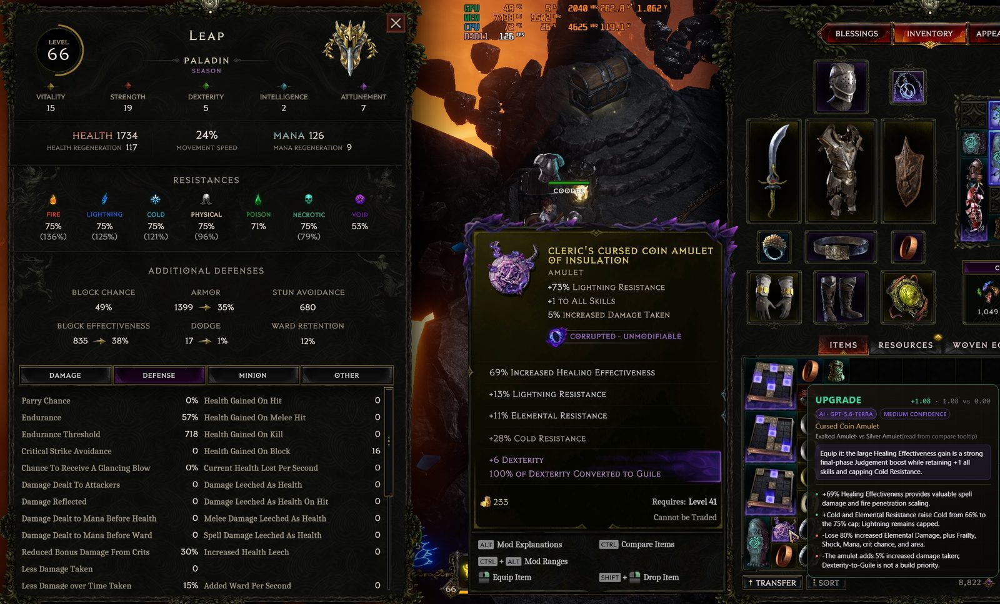
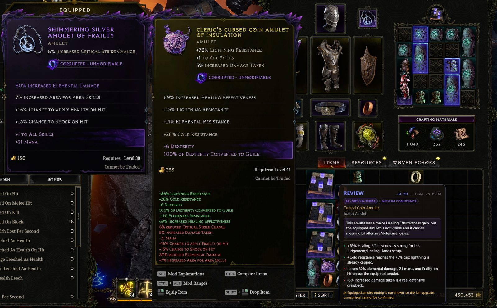
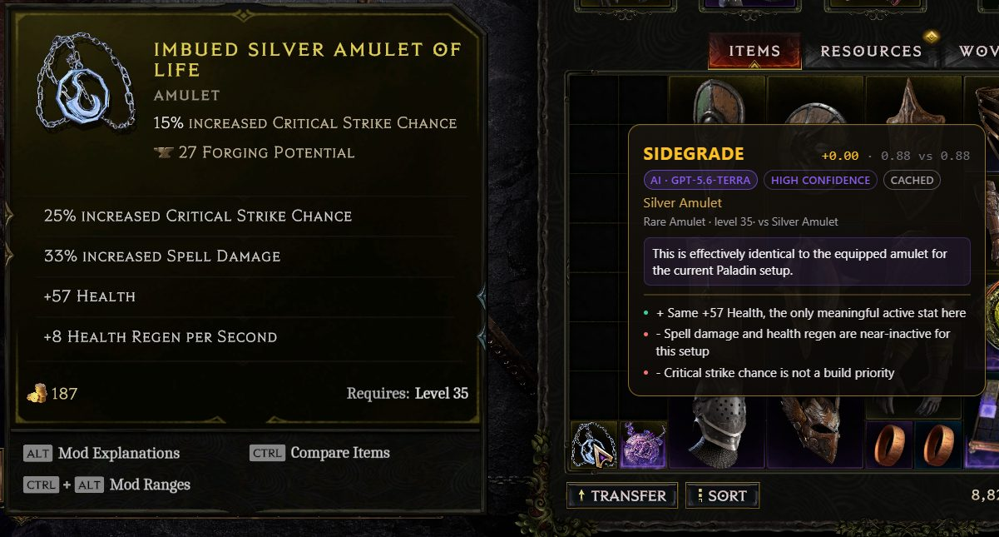
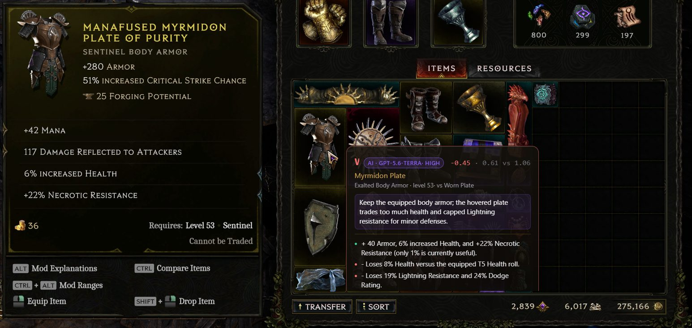
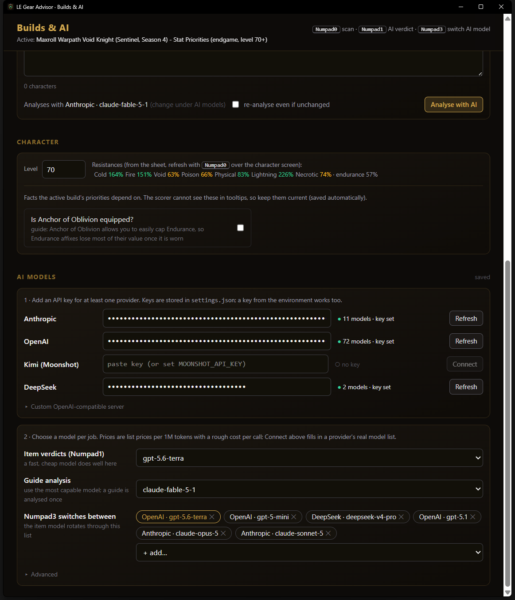
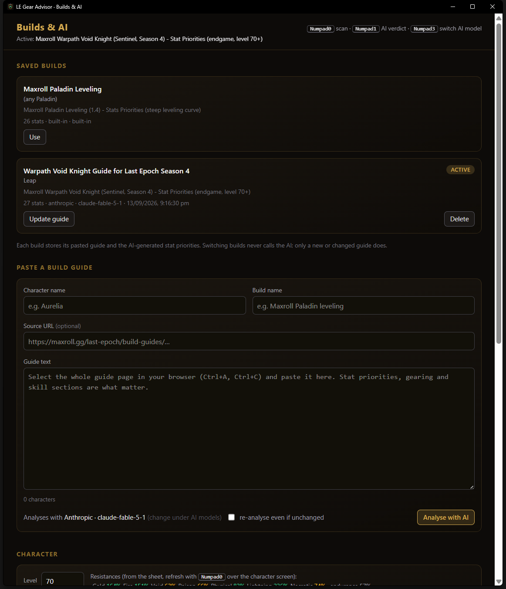

# LE Gear Advisor

[](https://github.com/Coodex/Last-Epoch-Gear-Advisor/releases/latest/download/LE.Gear.Advisor_0.1.0_x64-setup.exe)
[](https://github.com/Coodex/Last-Epoch-Gear-Advisor/releases)


**Hover a bag item in Last Epoch, press a key, get a verdict.** UPGRADE,
SIDEGRADE or WORSE against the item you are wearing, scored for *your* build
guide, with the reasons, right next to the tooltip.

**[Download the Windows installer](https://github.com/Coodex/Last-Epoch-Gear-Advisor/releases/latest)** · per-user setup, no admin rights, nothing to configure for the built-in Paladin leveling guide.

- **Numpad0** · instant verdict from the guide's stat priorities (deterministic, offline, under half a second).
- **Numpad1** · the same, then a language model reads both tooltips and explains the call in plain words.
- **Numpad3** · switch which model answers.
- **Any guide** · paste a build guide once; a model turns it into stat priorities for that character.

It only looks at pixels. No game files, no memory reading, no account data:
it screenshots the area around your cursor, reads the tooltips with the OCR
built into Windows, and draws a click-through card.

## Screenshots

| | |
|---|---|
|  |  |
| **Numpad1 on an amulet** with the character sheet open: the model reads the tooltip crops, the sheet numbers and the build's priorities, and explains the call. | **Auto Compare** shows the worn item next to the hovered one; the overlay judges only against what is on screen and says so when it cannot see it. |
|  |  |
| **Same item, same equipped, same model**: the stored answer comes back instantly with a "cached" pill, no tokens spent. | **Numpad0** is the deterministic scorer alone: score delta, the top reasons, warnings, in under half a second. |

## Quick start

1. Install and start **LE Gear Advisor**. It lives in the system tray (gold
   shield icon); a small "ready" toast shows the hotkeys for a moment.
2. In Last Epoch, turn on **Auto Compare Items** (the game then shows the
   worn item's tooltip, headed EQUIPPED, next to any bag item you hover).
   Windowed or borderless both work.
3. Open your inventory, hover an item, press **Numpad0**.
4. Read the card. It stays until you move the mouse.

That is the whole loop. The built-in profile is the Maxroll Paladin leveling
guide; for any other build see [Your build](#your-build-paste-a-guide).

## Hotkeys

| Key | What happens |
|---|---|
| **Numpad0** | Capture, read both tooltips, score them against the active build, show the card. |
| **Numpad1** | Numpad0, then the tooltip crops, the scores and your character go to the AI model you picked; the card updates with its verdict and one-line summary. Identical item/equipped/model combinations are answered from a local cache without a request. |
| **Numpad3** | Cycle the AI model through the list you set up (only models with a key). A toast names the new one. |
| **Numpad0 over the character sheet** | With nothing hovered: reads level and resistances from the sheet. Also happens on every scan when the sheet is open in the capture. |

Hotkeys are registered system-wide, so the game never sees them. They are
changeable in `settings.json` (avoid Alt/Ctrl chords: holding those changes
the tooltip at the moment it is captured). Captures only happen while Last
Epoch is the foreground window.

## What the card tells you

- **Verdict and delta.** The item's score minus the equipped item's score for
  the active build. `+0.10` and above is UPGRADE, `-0.10` and below WORSE,
  between is SIDEGRADE. Uniques show REVIEW (their special effects are not
  scored; Numpad1 handles them well).
- **Reasons.** The three biggest gains and losses, each named after the guide's
  stat priority it hits, with the affix tier.
- **Warnings.** Cannot equip yet (level), a resistance dropping below the
  75% cap, an equipped tooltip that was cut off or unreadable, a stat the
  scorer does not know.

Resistances are scored by headroom: a roll on an element you already have
capped is worth nothing, and the card says so ("cold capped"). Your current
resistances and level come straight from the character sheet whenever it is
on screen, so keep the sheet open next to the inventory if you like, or
press Numpad0 over it once in a while.

The overlay compares only against the EQUIPPED tooltip in the same capture.
If the game did not draw one, or it was cut off, the card shows REVIEW with
the item's own score and explains why, instead of guessing.

## AI verdicts (Numpad1)

Optional. Nothing AI-related runs until you add an API key.

1. Tray > **Builds & AI…**
2. Paste a key next to a provider: Anthropic, OpenAI, Kimi (Moonshot),
   DeepSeek, or any OpenAI-compatible server by URL. The provider's model
   list is fetched, which also proves the key works.
3. Pick a model for **Item verdicts** (a fast, cheap one does well) and one
   for **Guide analysis** (use the most capable; a guide is analysed once).
   The dropdowns show list prices per million tokens and a rough cost per
   call. Everything autosaves.

What the model gets: the two tooltip crops, the OCR text, the game's own
green/red compare block, the active build's priorities (with which rules are
active and why), your sheet numbers, a short sheet of Last Epoch mechanics
(Vitality is 6 flat Health, attribute effects, caps, how increased/more
stack) and the deterministic verdict as a hint. It answers with a strict
verdict, a one-line summary, reasons and warnings. Answers are cached by
item, equipped item, model, build and character, so re-pressing the key on
the same pair costs nothing; tray > *Clear AI verdict cache* resets that.

Text-only models get the OCR text instead of screenshots. Only the tooltip
crops, the OCR text and pasted guides leave the machine, and only to the
provider you chose.



## Your build: paste a guide

The scorer is driven by a stat-priority profile, and a model can write one
from any guide.

1. Tray > **Builds & AI…**, top of the window.
2. Character name, build name, optionally the guide's URL.
3. Select the whole guide page in your browser (Ctrl+A, Ctrl+C), paste it,
   press **Analyse with AI**. One to three minutes with a capable model.
4. The build is saved and becomes active. Pasting the same text again later
   reuses it with no AI call; a changed text re-analyses it. Switch between
   saved builds with **Use**; the built-in Paladin profile is always there.

Some priorities depend on things no tooltip shows ("once Anchor of Oblivion
is worn, Endurance stops mattering"). The model declares those as **facts**,
and the Character section of the window lists them as checkboxes or
counters. Answer them once; they save on change.



## Tray menu

- **Scan now** · same as Numpad0.
- **Builds & AI…** · the window above.
- **Hotkeys / AI item model** · read-only labels.
- **Enabled** · uncheck to pause the hotkeys without quitting.
- **Save debug captures** · writes every capture and its OCR text to `profile/debug/`; send those when an item is misread.
- **Clear AI verdict cache**, **Open profile folder**, **Quit**.

## Settings

`profile/settings.json`, next to the executable (or `%APPDATA%\LE Gear Advisor\profile`):

```json
{
  "hotkey": "Numpad0", "any_window": false, "card_seconds": 0, "debug_captures": false, "ocr_engine": "auto",
  "ai": {
    "hotkey_ai": "Numpad1", "hotkey_cycle": "Numpad3",
    "providers": {
      "anthropic": { "api_key": "", "base_url": "" },
      "openai":    { "api_key": "", "base_url": "" },
      "kimi":      { "api_key": "", "base_url": "" },
      "deepseek":  { "api_key": "", "base_url": "" },
      "openai-compatible": { "api_key": "", "base_url": "" }
    },
    "item":  { "provider": "anthropic", "model": "claude-sonnet-5" },
    "guide": { "provider": "anthropic", "model": "claude-opus-5" },
    "cycle": [ { "provider": "anthropic", "model": "claude-sonnet-5" }, { "provider": "anthropic", "model": "claude-opus-5" } ],
    "effort": "medium",
    "catalog": {}
  }
}
```

- `card_seconds` 0 keeps a card up until the mouse moves about 40 px; a
  positive value adds a timer.
- Hotkeys use Tauri shortcut syntax (`"F8"`, `"Numpad0"`, `"Ctrl+Shift+Space"`);
  restart the overlay after changing them.
- Empty API keys fall back to `ANTHROPIC_API_KEY`, `OPENAI_API_KEY`,
  `MOONSHOT_API_KEY`, `DEEPSEEK_API_KEY`.
- Model prices come from `core/data/model_prices.json` (providers do not
  expose them); copy it to `profile/model_prices.json` to add or correct entries.
- `catalog` caches fetched model lists. Files from the earlier per-model
  layout are migrated on load.

## Building from source

Requirements: Rust, Node 20+, WebView2 (part of Windows 11). No native build
tools: OCR is the Windows built-in engine, capture is `xcap`, both pure Rust.
The repo ignores the personal files under `profile/` (`settings.json` with
your keys, `character.json`, `builds/`, `ai_cache.json`); copy
`profile/settings.example.json` to `profile/settings.json` first.

```
cd app
npm install
npm run tauri dev      # run against the repo's profile/
npm run tauri build    # installer in target/release/bundle/nsis/
```

`le-gear-advisor --builds` starts the overlay with the Builds & AI window
open. Tests: `cargo test` (tooltips for every slot type, OCR quirks, panel
segmentation, verdicts, sheet reading, build library, AI plumbing).

---

## Under the hood

Everything below is for people who want to change the scoring, run it
without the overlay, or understand what a verdict is made of.

### Layout

```
core/            Rust library `le_core`
  src/text.rs            normalisation, OCR digit fixes, fuzzy matching
  src/game_data.rs       affixes / bases / uniques (embedded from core/data)
  src/item_parser.rs     tooltip lines -> ParsedItem (finds the item inside merged screen regions)
  src/guide_profile.rs   stat priorities as data: weights, conditions, facts, saturation
  src/character_state.rs character.json + equipped profile
  src/scorer.rs          item score with saturation and conditions
  src/compare.rs         verdict vs equipped item, warnings, weak-slot list
  src/sheet_reader.rs    level / resistances / endurance from the character sheet
  src/ocr.rs             Windows OCR (or tesseract.exe), line + panel grouping, text colour
  src/ai.rs              Anthropic + OpenAI-compatible clients, item and guide prompts, prices
  src/build_library.rs   saved builds (profile/builds), guide hashing
  data/                  affixes.json, bases.json, uniques.json, planner_*.json,
                         guide_profile.json, model_prices.json
cli/             `le-advisor` binary (same pipeline, no window)
app/             Tauri 2 overlay: src-tauri (capture, engine, tray, windows), src (Svelte 5 UI)
tools/build_data.py      rebuilds core/data from Maxroll's game data + planner (Python 3.12)
profile/                 your settings, character.json, builds/, equipped.json, ai_cache.json
```

### How a verdict is computed

The guide's Stats Priorities are data (`core/data/guide_profile.json`, or an
AI-generated profile per build). Each rule has regex patterns over affix
names, a weight, a group (offense/defense), optional conditions, an optional
`inactive_weight`, an optional `tier_target` and an optional saturation rule.

- An ordinary affix scores `weight * min(tier / tier_target, 1.2)`.
- Resistances score `weight * min(value, gap) / reference_roll`, where
  `gap = cap - (current - contribution of the item being replaced)`; capped
  elements are worth nothing and the note says so.
- Conditions: `phase`, `level`, build `flags` and `counters` (declared as
  `facts` in the profile), and the built-in Paladin profile's
  `heavens_bulwark_points`, `healing_hands_specced`, `solarum_plate_equipped`,
  `nagasa_scymitar_equipped`. A failed condition switches the rule to
  `inactive_weight`.
- Affixes not on the list score zero and are listed; unreadable lines are
  reported. Nothing about an item aborts parsing.
- Verdict: candidate score minus the equipped item's score in that slot
  (rings: the weaker ring). Uniques are REVIEW.

Profile fragment showing facts and phase brackets:

```json
"phase_levels": { "intermediate_from": 27, "final_from": 38 },
"facts": [
  { "key": "judgement_points", "label": "Points in Judgement", "kind": "counter", "default_count": 0 },
  { "key": "uses_shield", "label": "Shield equipped", "kind": "flag", "default_on": true }
],
"stats": [ { "...": "...", "conditions": [ { "counters": { "judgement_points": { "min": 5 } }, "flags": { "uses_shield": true } } ] } ]
```

Fact values live in `character.json` under `flags` / `counters`. Saved builds
are plain JSON files in `profile/builds/`; `profile/builds/active.txt` names
the active one.

The built-in Paladin leveling priorities:

| # | Offense | condition |
| --- | --- | --- |
| 1 | Ignite / Poison / Bleed chance | zero once Heaven's Bulwark has 5 points |
| 2 | Level of Javelin, Rive | early and intermediate setups |
| 2 | Level of Multistrike, Healing Hands, Holy Aura, Symbols of Hope | final setup |
| 2 | Level of Judgement (weight 1.4, target T5) | final setup |
| 3 | Elemental DoT, DoT, Fire damage | |
| 4 | Healing Effectiveness (weighted above its position) | |
| 5 | Increased Melee Attack Speed | |
| 6 | Spell damage | near zero unless Nagasa Scymitar is equipped |

| # | Defense | condition |
| --- | --- | --- |
| 1 | Health Regen | near zero once Healing Hands is specialised |
| 2 | Health | |
| 3 | Resistances, physical weighted higher | gap to the 75% cap, per element |
| 4 | Ward per Second, Ward Decay Threshold | |
| 5 | Endurance | zero once Solarum Plate is equipped |
| 6 | Vitality | |
| 7 | Frailty / Slow / Chill chance | |
| 8-9 | Block Chance, Block Effectiveness | only after 5 points in Heaven's Bulwark |
| 10 | Armour | |
| 11 | Dodge | |

### character.json

```json
{
  "level": 54,
  "phase": null,
  "resistances": { "fire": 89, "cold": 84, "lightning": 93, "physical": 142,
                   "necrotic": 58, "void": 114, "poison": 23 },
  "endurance": 46,
  "heavens_bulwark_points": 0,
  "healing_hands_specced": true,
  "solarum_plate_equipped": false,
  "nagasa_scymitar_equipped": false,
  "flags": {}, "counters": {}
}
```

`level` picks the setup phase (built-in profile: 1-26 early, 27-37
intermediate, 38+ final; AI profiles bring their own brackets); `phase`
overrides it. `resistances` are the sheet's uncapped totals (the number in
parentheses when the sheet shows `75% (89%)`), which is what the sheet reader
stores. Every field has a default.

### Tooltip parsing

Real tooltip layout: title (affix titles plus the base name, may wrap), a
"[CLASS] TYPE" line, one line per base implicit, affixes, then "Requires:
Level N"; the game's green/red compare block follows and is cut off by text
colour. The type line fixes the slot, the longest base name inside the title
fixes the base, the base's implicit count separates implicits from affixes.
Affix lines are fuzzy-matched against what can roll on that item type, with
OCR quirks handled (upper case, dropped spaces, `0` read as `O`, `%` read as
`0/0`). Tiers are inferred from the value using the affix's per-tier roll
ranges. When a tooltip is drawn over the inventory grid and OCR merges it
with the grid's labels, the item is located by its type line. The "EQUIPPED"
label the game draws above the compare tooltip is matched by position to the
tooltip beneath it.

### CLI

`le-advisor` runs the same pipeline on screenshots or pasted tooltip text,
for testing the scorer or scripting:

```
cargo build --release
target\release\le-advisor.exe --help

le-advisor parse item.png                  # what the parser sees
le-advisor compare item.png                # verdict against equipped.json
le-advisor equip boots.txt                 # store an equipped item (slot inferred; rings: --slot ring2)
le-advisor weak-slots                      # which equipped slot to replace first
le-advisor character                       # state + which rules are active and why
le-advisor sheet sheet.png --apply         # read the character sheet
le-advisor ocr capture.png                 # panels found in a capture (green/red tagged)
le-advisor builds / use-build <id>         # saved builds
le-advisor analyze-guide guide.txt --character X --build Y
le-advisor ai item.png [--model openai/gpt-5-mini]
le-advisor models --provider openai        # a provider's models with prices
le-advisor guide / update-guide            # the Maxroll planner gear plan
```

`--json` on any command prints the structures the overlay uses;
`--guide-profile FILE` scores with another profile. Tooltip text files hold
one tooltip line per row exactly as the game shows them. Regenerating the
game data (only when the game or the guide changes): `py -3.12 tools/build_data.py [guide-url-or-planner-id]`, then rebuild.

Not built: the optional WebSocket + PWA mirror for a second screen.
